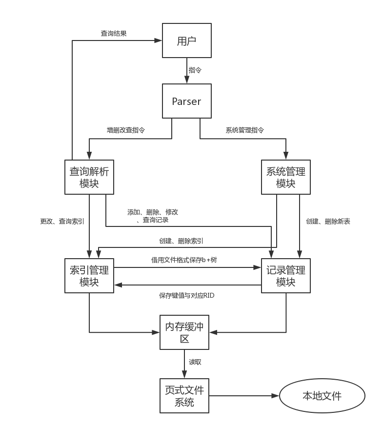

# 项目总结报告
2015011317 祝方韦

## 一. 系统架构设计
系统架构主要分为五个模块：查询解析模块，系统管理模块，索引管理模块，记录管理模块，页式文件系统。其中，页式文件系统使用了课程提供的代码，并经过一些修改;其余模块代码为自行编写。     
模块之间的关系如下:    
    

## 二. 各模块详细设计
### 1. 页式文件系统    
主体采用课程提供的代码，在此基础上进行了一些额外的修改，移除了无用和容易引起冲突的全局变量，将其余的全局变量放入.cpp文件中，保证使用cmake编译时不产生错误。    
该模块提供的功能为带缓存的页式文件系统，允许进行缓存过的读写操作。    

### 2. 记录管理模块    
为了防止潜在的内存泄漏，本次项目中没有使用C风格的指针来管理临时数据，而是利用了C++11的新特性，将所有二进制数据的中间结果表示为`shared_ptr<vector<unsigned char>>`类型。这样，在中间结果被使用完后，其引用计数会减至0，被系统自动回收，从而防止了潜在的内存泄漏问题。为了方便编写代码，将此类型定义为`data_ptr`，其他代码中的中间二进制数据都按此储存。    
记录管理模块主要分为两个大部分：记录文件，表与列的元数据。    

#### 2.1. 记录文件    
对应类为`FixedRecordFile`，`UnfixedRecordFile`。     
记录文件分为定长文件`FixedRecordFile`与非定长文件`UnfixedRecordFile`两种，都使用第二章课件中提到的槽式储存方法。    
定长文件用于记录不含变长列的数据。由于每一条记录定长，可以提前计算出每一页中的记录最大数量，因此在每一页末尾使用bitmap来记录当前页面的槽位使用情况。插入数据时选择最靠前且未被占用的槽放置数据，删除数据时将对应槽位标为未使用，修改数据时直接在对应槽位上修改;    
非定长文件用于记录含变长列的数据。数据不定长时，使用定长文件的方式进行维护较为困难，所以非定长文件在页末尾分别记录每一条数据的起始位置和长度，以此来标定数据位置。插入数据时寻找一个可以容纳新记录的页并将记录放在空闲空间开头，删除数据时将对应数据槽长度置为-1,更改数据时将原数据删除，再插入新数据。    
每个数据表对应一个记录文件，总记录条数，文件目前页数等元数据记录在文件的第一页，第二页开始为具体数据。
在两种不同记录文件的基础上，包装出一个包含了抽象接口的`AbstractRecordFile`类作为外界接口。    

#### 2.2 表与列的元数据
对应类为`TableInfo`, `ColumnInfo`。    
在使用数据库的过程中，不可避免地会用到表与列的相关数据。如果将其和记录文件放在一起，每一次需要使用时都去记录文件对应位置查询，则显得麻烦。    
本项目中，将数据表的元数据使用json格式储存在单独的文件中，打开表时自动读取并生成对应的类(`TableInfo`, `ColumnInfo`)。这样的好处是可以方便地查询表与列的信息（名称，列数量，列类型，列长度等）。    
此外，由于有了整个表的信息，可以将记录文件中的二进制数据，与列和对应值组成的键值对map进行便捷的转换，借此构造`RecordConverter`类。该类可以完成键值map到二进制数据的相互转换，使得修改或生成数据时只需要给map中对应位置赋值，而不需要使用指针进行定位，大大降低了编程复杂度。    
每一条记录的二进制数据储存格式与第二章课件中的格式相同(标志位-定长数据-null位图-非定长数据). 

#### 2.3 杂项
为了编写代码方便，该模块中还有一些辅助类。`RID`代表数据的rid，可以和int类型互相转换;`DataOperands`提供了数据类型的一些杂项操作（获取名称，同类型间比较，类型间转化）,`DataContainer`提供了根据原始数据生成对应二进制数据的接口。    

### 3. 索引管理模块
索引管理模块使用B+树实现了索引机制，对应类为`BPlusTree`。    
本项目中的B+树使用了溢出页机制，如果有key相同的值，叶节点对应位置上储存的就不再是值，而是对应的溢出页号，溢出页中会按顺序储存该key对应的值。    
在给数据库编写B+树时，最难的地方在于不定长的key。key不定长容易引起每一个节点中难以放入相同个数的数据，从而引起其它问题。     
本项目中的解决方法是为所有B+树中的key建立一个单独的定长记录文件，而B+树对应位置则放置key在记录文件中的RID。这样一来，无论索引对应的key类型如何，长度如何，B+树中的一个单元大小都固定：key在键文件中的RID,节点下属的数据数量，节点对应的数据(子页编号/记录RID)。这样每一页中的数据块个数固定，且可以使用数组的方式访问，大大减少复杂度。    
模块中的B+树提供了增删改查和遍历的接口，同时支持获取某个值对应的上界与下界节点。    

叶节点结构：    
```
键位置[0]               键位置[1]               ...       键位置[n-1]
溢出页ID或对应RID[0]     溢出页ID或对应RID[1]     ...       溢出页ID或对应RID[n-1]
对应记录数量[0]          对应记录数量[1]          ...       对应记录数量[n-1]
```    
中间节点结构：    
```
(无意义)                键位置[1]               ...       键位置[n-1]
溢出页ID或对应RID[0]     溢出页ID或对应RID[1]     ...       溢出页ID或对应RID[n-1]
对应记录数量[0]          对应记录数量[1]          ...       对应记录数量[n-1]
```    

### 4. 系统管理模块
系统管理模块实现了数据库，数据表和索引的创建删除，以及一些元数据展示功能。对应类为`SystenStatement`。    
在解析用户输入指令的部分，使用lex&yacc的工具链进行处理。程序的入口使用`yyrestart`标定输入，再调用`yyparse`进行解析。    
在yacc解析程序中，每条指令都会被实例化成一个`Statement`的子类，最后统一调用`run()`的接口执行。    
本项目中，所有数据统一储存在`/build/data/`中，每一个数据库都是一个文件夹，其中储存着所有表信息。在打开或切换数据库时，会自动读取其中所有表的元数据，并创建对应`TableInfo`对象，将指针储存在指针池中。这样，访问对应表时就可以快速找到对应对象，切换或关闭数据库时也会因为指针池的清空自动触发析构函数，写回相关数据。    

### 5. 查询解析模块
查询解析模块实现了增删改查指令的执行。对应类为`CrudStatement`。     
由于在记录管理模块中已经实现了数据的插入，删除与某个特定域的修改，所以增删改操作的工作量相对较小，查询操作相对较难。    

#### 5.1. 增删改操作
第一部分中已经预留了增删改的接口，且增删改的操作都必定在同一张表中，所以主要工作是根据where语句来选取符合条件的rid。    
常见的where语句分为两种，一种为某一列与具体值比较，一种为两列间比较。如果是与具体值比较，并且该列有对应索引，那么可以根据索引直接获取相应的RID列表;如果该列没有索引或者条件是列间比较，则只能遍历整张表来获取符合条件的RID。    
当有多个条件时，项目中会先尝试在有索引的具体值比较条件中，找出结果数量最少的一个，将其作为基础，然后逐个测试其中结果是否满足其他条件，最后得到正确结果。    
此外，在实际进行查询前，还会对各个where条件和具体修改的值进行检查：    
对于where条件，会检查两侧数据类型是否可以互相转化(如字符串类型的常量可转化为date, varchar等)，或者两边的列是否具有同一类型;    
对于插入与更新语句，会额外检查每一个新记录域上的值是否类型正确，是否满足了主键约束（不重复），是否满足了外键约束（在对应表中存在），是否满足空值约束;     
对于删除语句，如果当前表中有某个域被其他表使用为外键约束，会删除那些表中使用了被删除记录中对应域值的记录，如果新表中也有列被作为外键约束，则会递归进行这一过程。    

#### 5.2 查询操作
查询操作和增删改操作相比，增加了跨表的可能，无法简单地选取符合条件的rid。首先，由于查询列和条件列不一定在同一张表中，需要遍历每一个表，为每一个列寻找对应的表;其次，和增删改操作相同，需要检查where语句的合理性;    
在确定了合理性之后，为了加速查询速度，对多表和单表进行不同的优化：     
对于单表，优化方式类似于增删改操作，尝试在有索引的具体值比较条件中，找出结果数量最少的一个，将其作为基础，然后逐个测试其中结果是否满足其他条件，最后得到正确结果。    
对于多表，对所有where条件进行一个拓扑排序：与实际值比较列所在的视为最高优先级(值为0)，而没有与实际值比较的列所在的表，其优先级为与其比较的列中最小值+1。之后，再根据每一个条件中的表优先级对条件排序。    
最后，按照优先级由高到低的顺序筛选RID，目标是获取一个所在表优先级从高到低的RID序列的集合。对于每一个条件，根据具体情况进行判断：    
对于列与值间的比较，如果该列所在表已经被查询过，则遍历该表中已选RID进行筛选;如果所在表未查询过，则根据有无索引分别进行索引查询和遍历查询，获取合理的RID列表。    
对于列与列间的比较，如果两列都出现过，则遍历所有已出现的RID组，剔除不合理的组合;如果出现过一列，则遍历目前为止所有已确定的高优先级表的RID序列，对每一个序列，将该列视为常数进行查询;如果两列都没有出现过，如果两列在同一表中，则遍历所有RID,否则遍历所有可能的RID的笛卡尔积，找出符合条件的RID组。    
排序完成后，找出对应的列，或者计算对应结果（聚合查询），输出到终端。

## 三. 主要接口说明
### 1. 记录管理模块
记录文件通用接口`AbstractRecordFile`:    
```
class AbstractRecordFile{
public:
    virtual ~AbstractRecordFile(){
        
    }

    virtual RID insertData(data_ptr dat) = 0;   //插入二进制数据dat，返回插入位置RID
    virtual bool deleteData(RID target) = 0;    //删除位于RID的数据，返回是否成功
    virtual data_ptr getData(RID target) = 0;   //获取位于RID的数据，成功返回对应结果，失败返回nullptr
    virtual RID updateData(RID target, data_ptr dat) = 0;   //更新位于RID的原数据为新数据dat，返回新数据位置

    virtual RID getCurrentRID() = 0;            //遍历文件时，获取当前RID位置
    virtual data_ptr firstData() = 0;           //将遍历指针指向第一条记录并返回其内容，如果不存在返回nullptr
    virtual data_ptr nextData() = 0;            //获取下一条记录内容，如果不存在返回nullptr

    virtual void closeFile() = 0;               //关闭记录文件并写回更改
};
```    

列信息`ColumnInfo`:    
```
class ColumnInfo{
public:
    ColumnInfo(TableInfo *t, string rawJson);   //根据json字符串构造列信息对象
    ColumnInfo(TableInfo *t, string colName, varTypes colType, int siz, int useIndex = 0);  //根据具体参数构造列信息对象
    ~ColumnInfo();

    json11::Json infoToJson();                  //生成对应的json对象
    string toJsonDump();                        //生成对应的json字符串
    void setPrimary(bool para);                 //更改当前列是否为主键

    TableInfo* tabInfo;                         //对应的数据表信息对象
    shared_ptr<BPlusTree> indexTree = nullptr;  //如果该列有索引，指向索引对象
    string columnName;                          //列名
    string columnTypeName;                      //列数据类型名
    varTypes columnType;                        //列数据类型

    bool isFixed;                               //是否定长
    bool allowNull = true;                      //是否可以为空值
    bool isPrimary = false;                     //是否为主键
    bool hasForeign = false;                    //是否有外键约束
    string foreignTableName = "";               //如果有外键约束，外键所在表名
    string foreignColumnName = "";              //如果有外键约束，外键所在列名
    vector<pair<string, string>> referedBy;     //引用该列作为外键约束的列信息列表，格式为(表名，列名)

    int size;                                   //定长列的数据长度或变长列的最大长度
    int showLength = -1;                        //int 类型的显示长度
    int useIndex = 0;                           //是否有索引
};
```    

表信息`TableInfo`:    
```
class TableInfo{
public:
    TableInfo(string tableName, bool newTable = false);     //创建新表
    ~TableInfo();

    void addNewColumn(string colName, varTypes colType, int siz, int useIndex = 0); //添加新列
    string infoToString();  //生成对应json字符串
    void writeBack();       //将更改写回到数据文件
    void genConverter();    //生成键值对和二进制数据的转换器
    int getFixedLength();   //表中定长列长度之和
    int getFixedRecordLength(); //二进制数据中定长列对应部分长度
    void showTableInfo();   //打印表信息
    void openDataFile();    //打开表对应的记录文件。注意：调用此函数时应该已经确定好不会添加新的列，否则会引起错误

    string tableName, infoFileName;                         //表名与表元信息文件名
    int colNumbers, fixedColNumbers, unfixedColNumbers;     //总列数，定长列数，非定长列数
    vector<shared_ptr<ColumnInfo>> colInfos;                //根据列位置对应的列信息对象指针
    map<string, int> colIndex;                              //列名与对应位置的映射
    map<string, shared_ptr<ColumnInfo>> colInfoMapping;     //根据列名称对应的列信息对象指针
    fstream fs = fstream();                                 //读写表元信息文件所用的fstream
    shared_ptr<RecordConverter> cvt;                        //表对应的键值对和二进制数据的转换器
    shared_ptr<AbstractRecordFile> dataFile = nullptr;      //表对应的记录文件
};
```    

数据转换器`RecordConverter`:    
```
class RecordConverter{
public:
    RecordConverter(TableInfo *t);
    ~RecordConverter();
    data_ptr toByteArray();                             //根据现有的键值对映射生成二进制数据
    void fromByteArray(data_ptr dat);                   //根据二进制数据生成键值对映射
    void fromNameValueMap(map<string, data_ptr> vmap);  //拷贝已有的键值对映射(键为列名)
    void fromIndexValueMap(map<int, data_ptr> vmap);    //拷贝已有的键值对映射(键为列位置)

    void showValues();                                  //打印目前的键值对映射信息

    data_ptr getRawData(string colName);                //获取与设置二进制数据的接口
    data_ptr getRawData(int colIndex);
    void setRawData(string colName, data_ptr dat);
    void setRawData(int colIndex, data_ptr dat);

    int getInt(string colName);                         //获取与设置整数数据的接口
    int getInt(int colIndex);
    void setInt(string colName, int dat);
    void setInt(int colIndex, int dat);

    float getFloat(string colName);                     //获取与设置浮点数数据的接口
    float getFloat(int colIndex);
    void setFloat(string colName, float dat);
    void setFloat(int colIndex, float dat);

    string getChar(string colName, bool strip = false); //获取与设置字符串数据的接口
    string getChar(int colIndex, bool strip = false);   //strip为真时会删除字符串末尾的多余空格
    void setChar(string colName, string dat, bool padding = true);  //padding为真时会在字符串末尾补空格
    void setChar(int colIndex, string dat, bool padding = true);

    decimal getDecimal(string colName);                 //获取与设置十进制小数数据的接口
    decimal getDecimal(int colIndex);
    void setDecimal(string colName, decimal dat);
    void setDecimal(int colIndex, decimal dat);

    date getDate(string colName);                       //获取与设置日期数据的接口
    date getDate(int colIndex);
    void setDate(string colName, date dat);
    void setDate(int colIndex, date dat);

    void setNull(string colName);                       //判别与赋值空值的接口
    void setNull(int colIndex);
    bool isNull(string colName);
    bool isNull(int colIndex);

    TableInfo *tinfo;                                   //对应表信息指针
    vector<data_ptr> values;                            //键值对映射
    int fixedLength;                                    //定长列总长度
    vector<int> colOffset;                              //对于定长列，值为距离定长数据块头位置;对于非定长列，值为它"是第几个非定长列"的相反数．
};
```     

`RID`:    
```
class RID{
public:
    RID();
    RID(int raw);           //根据对应整数构造RID
    RID(int p, int s);      //根据页数，槽数构造RID
    int toInt();            //生成RID对应整数
    int pagenum;            //页数
    int slotnum;            //槽数

    bool operator==(const RID &other);
};
```    

数据杂项操作`DataOperands`:    
```
class DataOperands{
public:
    static const map<string, varTypes> nttMap;                      //数据类别名称对应的类别
    static map<string, varTypes> createMap();
    static string typeName(varTypes t);                             //获取类别对应名称
    static varTypes nameToType(string s);                           //获取名称对应类别
    static int compare(varTypes t, data_ptr left, data_ptr right);  //给定类别，计算两个二进制数据的相减结果;非整数类型时表达大小关系，-1小于，0等于,1大于
    static data_ptr add(varTypes t, data_ptr left, data_ptr right); //给定类别，计算两个二进制数据的相加结果，不可相加时返回nullptr
    static int getTypeSize(varTypes t);                             //获取固定大小的类别对应大小
    static string toString(varTypes t, data_ptr p);                 //给定类别，生成二进制数据对应字符串
};
```     

二进制数据生成器`DataContainer`:    
```
class DataContainer{
public:
    static data_ptr genDataContainer(int size){                     //生成固定大小的数据容器
        data_ptr res = make_shared<vector<unsigned char>>(size);
        memset(res->data(), 0, size);
        return res;
    }

    static void concat(data_ptr a, data_ptr b){                     //连接两个数据容器
        int sizea = a->size();
        int sizeb = b->size();
        a->resize(sizea+sizeb);
        memcpy(a->data()+sizea, b->data(), sizeb);
    }

    static data_ptr genIntData(int v){                              //生成整数对应的数据容器
        data_ptr res = genDataContainer(sizeof(int));
        *(int*)(res->data()) = v;
        return res;
    }

    static data_ptr genFloatData(float v){                          //生成浮点数对应的数据容器
        data_ptr res = genDataContainer(sizeof(float));
        *(float*)(res->data()) = v;
        return res;
    }

    static data_ptr genShortData(short v){                          //生成短整数对应的数据容器
        data_ptr res = genDataContainer(sizeof(short));
        *(short*)(res->data()) = v;
        return res;
    }

    static data_ptr genStringData(string s){                        //生成字符串对应的数据容器
        data_ptr res = genDataContainer(s.length());
        for (unsigned int i=0;i<s.length();i++){
            res->data()[i] = (unsigned char)s[i];
        }
        return res;
    }

    static data_ptr genDecimalData(int i, int r){                   //生成十进制小数对应的数据容器
        data_ptr res = genDataContainer(sizeof(int)*2);
        *(int*)(res->data()) = i;
        *(int*)(res->data()+sizeof(int)) = r;
        return res;
    }

    static data_ptr genDateData(int year, int month, int day){      //生成日期对应的数据容器
        data_ptr res = genDataContainer(sizeof(int)*3);
        *(int*)(res->data()) = year;
        *(int*)(res->data()+sizeof(int)) = month;
        *(int*)(res->data()+sizeof(int)*2) = day;
        return res;
    }
};
```    

### 2. 索引管理模块
B+树`BPlusTree`:    
```
class BPlusTree{
public:
    BPlusTree(string tableName, string colName, varTypes type);
    ~BPlusTree();

    void insert(data_ptr key, int rid);         //插入键为key，值为rid的数据组
    void remove(data_ptr key, int rid);         //删除键为key，值为rid的数据组
    bool has(data_ptr key);                     //判断树中是否有键为key的数据组
    int count(data_ptr key);                    //统计树中键为key的数据组数量
    int lesserCount(data_ptr key);              //统计树中键小于key的数据组数量
    int greaterCount(data_ptr key);             //统计树中键大于key的数据组数量
    BPlusTreeIterator begin();                  //返回位于叶节点起始位置的迭代器
    BPlusTreeIterator lowerBound(data_ptr key); //返回小于等于key位置的迭代器
    BPlusTreeIterator upperBound(data_ptr key); //返回大于key位置的迭代器
    vector<RID> getRIDs(data_ptr key);          //返回所有键为key的数据组对应的RID
    int totalCount();                           //统计树中所有数据组数量

    string tableName, colName;                  //对应的表名和列名
    varTypes type;                              //键的数据类型

    shared_ptr<BPlusTreeFile> treeFile = nullptr;       //B+树结构文件
    shared_ptr<UnfixedRecordFile> keyFile = nullptr;    //储存键的记录文件

    void closeIndex();                          //关闭该索引并写回更改
    void deleteIndex();                         //删除该索引
}
```    

B+树迭代器`BPlusTreeIterator`:    
```
class BPlusTreeIterator{
public:
    BPlusTreeIterator(BPlusTree* bt);
    BPlusTreeIterator(BPlusTree* bt, BPlusNode* bn, int keyn, int valn);

    data_ptr getKey();          //当前位置的键
    int getValue();             //当前位置的值
    void next();                //下一个位置(考虑多个键值情况)
    void nextKey();             //无论有没有键值相同的记录，直接跳到下一个键值位置
    void previous();            //上一个位置(考虑多个键值情况)
    void previousKey();         //无论有没有键值相同的记录，直接跳到上一个键值位置
    bool available();           //当前位置是否有意义（是否已经到达边界外）
    void setToBegin();          //重置到起始位置
    bool equals(const BPlusTreeIterator &other);
};
```    

### 3. 系统管理模块
数据库管理器`DatabaseManager`:    
```
class DatabaseManager{
public:
    DatabaseManager();
    ~DatabaseManager();

    void showDatabases();                   //打印目前有的数据库列表
    void switchDatabase(string dbName);     //切换到名为dbName的数据库
    void createDatabase(string dbName);     //创建名为dbName的数据库
    void dropDatabase(string dbName);       //删除名为dbName的数据库

    void showTables();                      //打印当前数据库下数据表列表
    shared_ptr<TableInfo> createTable(string tableName);    //创建名为tableName的数据表
    shared_ptr<TableInfo> createTable(string tableName, vector<pair<string, varTypes>> cols, vector<int> sizes);    
    //创建名为tableName的数据表，并根据列名，列类型等信息添加相应列
    shared_ptr<TableInfo> openTable(string tableName);      //打开名为tableName的数据表并返回表信息指针
    void dropTable(string tableName);                       //删除名为tableName的数据表
    void descTable(string tableName);                       //打印名为tableName的数据表信息
    void openDataFile(shared_ptr<TableInfo> p);             //在确定名为tableName的数据表的列结构的情况下，打开相应数据文件

    bool addIndex(string tableName, string colName, int mode=1);    //为表中某一列添加索引
    bool dropIndex(string tableName, string colName);               //删除表中某一列的索引

    map<string, shared_ptr<TableInfo>> tablePool;           //表名到表信息对象指针的映射
    string databaseName = "";                               //当前使用的数据库名称
};
```    

指令共通接口`Statement`:   
```
class Statement{
public:
    virtual void run(DatabaseManager *db) = 0;  //执行指令
    virtual ~Statement() = 0;
};
```    

程序入口`Glue`:    
```
void parseSQL(string fileName); //执行文件内的sql指令
void parseSQL(FILE* in);        //从in中读取sql指令并执行
```

### 4. 查询解析模块
增删改查命令的接口与指令共通接口`Statement`相同。    

增删改查实用函数`CrudHelper`:    
```
class CrudHelper{
public:
    static bool convertible(varTypes to, varTypes from);                //判断类型from是否可转化成类型to
    static data_ptr convert(varTypes dest, Value &v, bool &success);    //将值转化为dest类型的形式

    static const int failed = 1e9;
    static int getCount(shared_ptr<TableInfo> tif, const WhereClause &wc);  //获取表中满足约束条件的记录数量，难以计算时返回failed
    static vector<RID> getRIDsFrom(shared_ptr<TableInfo> tif, const vector<WhereClause> &wcs);  //获取表中满足多个约束条件的RID列表
    static vector<RID> getRIDsFrom(shared_ptr<TableInfo> tif, const WhereClause &wc);           //获取表中满足单个约束条件的RID列表
    static bool checkCondition(shared_ptr<RecordConverter> cvt, data_ptr data, const WhereClause &wc);      //检查二进制数据转化后，是否满足某个约束
    static void solveForeignKey_delete(DatabaseManager *db, shared_ptr<TableInfo> tif, const vector<RID> &rids);    //递归删除受外键约束影响的记录

    static bool getTableName(DatabaseManager *db, Column &col, vector<string> &tables);         //获取某一列可能对应的表名
    static WhereClause genConstraint(string tableName, string columnName, Value v, WhereOperands op = WhereOperands::WHERE_OP_EQ);  //生成对应约束条件

    static void sortCrossTables(DatabaseManager *db, vector<string> tableNames, vector<WhereClause> whereConditions, vector<string> &sortedTables, vector<WhereClause> &sortedWhereConditions);
    //对条件和表进行拓扑排序
};
```

## 四. 实验结果
本项目成功完成了实验的基础要求：用SQL语言执行系统操作（操作数据库，数据表）与增删改查操作。此外，还实现了以下额外功能:    
1. 利用拓扑排序等方法优化查询，实现三表以上的多表联合查询;    
2. 支持日期，十进制小数等数据类型;     
3. 支持计数，平均值，最大最小值等聚合查询;    
4. 利用`std::regex`库，实现模糊查询;    
5. 支持外键约束，主键约束。

## 五. 小组分工
祝方韦 2015011317 所有内容

## 六. 参考文献
课件
《算法导论》